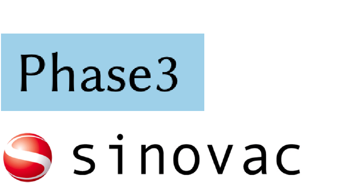

css: style.css

<!-- menu  -->

<a href=#about>About</a> ||| <a href=#vaccines>Vaccines</a> ||| <a href=#therapeutics>Therapeutics</a> ||| <a href=#children>Children</a>

######  [about]
# Research Library 
The COVID-19 Research Updates aims to support up-to-date awareness regarding 3 main research frontiers pertaining to COVID-19: vaccines, therapeutics, and research in children.
######  [vaccines]
# Vaccines

### Q: What are the different types of clinical trials?
- **Preclinical trials** involve testing drugs in non-human subjects. A wide range of doses is tested to obtain preliminary efficacy, toxicity, and pharmacokinetic information of the drug. Preclinical studies determine whether a candidate drug has the potential for further testing in clinical trials. Classically, clinical trials are divided into phases 1-4, in which early phase trials may provide essential information for late-phase trials.

- **Phase 1 studies** generally involve human pharmacology studies, in which the drug profile regarding safety, tolerance, and interactions with other drugs are established. Pharmacokinetics (Pharmacokinetics studies how the body affects the drug after administration through absorption, distribution, metabolism, excretion) and pharmacodynamics (Pharmacodynamics studies how the drug affects the body. In particular, dose-response relationships) of the drug are also explored in phase 1. Participants in phase I clinical trials are typically healthy volunteers, with a number of participants ranging around 20 to 100.

- **Phase 2 studies** involve therapeutic exploratory studies, which look at the effects of various doses. Typically, biomarkers are used as an indicator for the outcome. Phase 2 studies are primarily used to determine the biological effect of the drug and to narrow down the safe dosage obtained in phase 1, in order to determine an optimal dosage.  Side effects are assessed in this stage as well. Participants for phase 2 trials are usually selected under strict inclusion criteria, consisting of several hundred patients with a specified medical condition(s). The phase 2 trial is a necessary and crucial step to turn an early-stage experimental vaccine into a promising vaccine candidate in an efficacy trial in a large population.

- **Phase 3 trials** consist of therapeutic confirmatory studies, which are used to compare the new drug to an existing drug or a standard treatment. The effectiveness of the new drug in clinical practice is assessed in Phase 3 trials.  Participants in the phase 3 trial are usually selected under the same criteria as the phase 2 study but with a larger recruitment target of approximately thousands of participants.
Phase 4 trials can also be referred to as post-marketing surveillance. These studies are conducted after the drug is approved by regulatory authorities (FDA). Phase 4 studies collect information regarding long-term risks, adverse events, and how the drug works when it is used in a much larger population.

<!-- |  aaaaaaaaaaaa |  b |  b | b  |  b |
|---|---|---|---|---|
|  aaaaaaaaaaaaaaaaaaaaaaaa |  b |  b | b  |  b |
|  aaaaaaaaaaaaaaaaaaaaaaaa |  b |  b | b  |  b |
|  aaaaaaaaaaaaaaaaaaaaaaaaa |  b |  b | b  |  b |
|  aaaaaaaaaaaav |  b |  b | b  |  bbbbbbbb bbbbb | -->
 

### Q: What are the different vaccine candidates currently undergoing Phase 2/3 or Phase 3 trials globally?  Q: What are preliminary results indicating?

Currently, we keep track of vaccine candidates for COVID-19 under Phase 2/3 or Phase 3 trials with a brief introduction below.

 

      
   
   

### **mRNA-1273**
   The mRNA-1273 is an mRNA vaccine candidate currently in clinical trial phase 3 in the United States. An mRNA vaccine uses a different approach compared to conventional vaccines. Conventional vaccines are made up of small or inactivated doses of the whole disease-causing organism, or the proteins that it produces, which are introduced into the body to provoke the immune system into mounting a response. However, mRNA vaccine works by stimulating our own bodies to produce viral proteins, using a sequence of mRNA that codes for the virus antigen. Once the mRNA strand in the vaccine is inside the body’s cells, the cells use the genetic information to produce the antigen. This antigen is then displayed on the cell surface, where it is recognized by the immune system. The mRNA-1273 vaccine candidate relies on lipid nanoparticles (LNPs) to effectively deliver the mRNA strand into human bodies. LNPs technology is now one of the most clinically advanced non-viral gene delivery systems.

   [`The phase 1 preliminary result`](https://www.nejm.org/doi/full/10.1056/nejmoa2022483) published in the New England Journal of Medicine showed that the Moderna vaccine candidate induced immune response among all study participants. The two-dose vaccine series candidate has an acceptable safety profile across three dosage groups (25 μg, 100 μg, 250 μg) with no trial limiting safety concerns identified. Greater reactogenicity followed the second vaccination, were particularly in the highest dose group (250 mg).The finding supports further development into the ongoing phase 2 trial, evaluating doses of 50 μg and 100 μg. A large phase 3 efficacy trial evaluating the dose 100 μg has begun on July 27, enrolling 30,000 healthy people at around 89 sites in the United States.
   

      
   
   

### **Sputnik V**
   The Sputnik V is a vaccine candidate currently in clinical trial phase 3 in Russia. Sputnik utilizes adenovirus type 5 and type 26 vector to deliver the SARS-CoV-2 spike protein into human bodies to induce an immune response. On August 11, the Russian government registered Sputnik V as the world’s first coronavirus vaccine, developed by the Gamaleya Institute based in Moscow. However, the vaccine has not completed three phases of trials; thus, there are many concerns over its safety and effectiveness. 

   [`Phase 1/2 preliminary results`](https://www.thelancet.com/journals/lancet/article/PIIS0140-6736(20)31866-3/fulltext) published in the Lancet demonstrated a good safety profile and induced strong immune responses in all study participants.According to the study data, the vaccine candidate was generally safe, well-tolerated, and induced a strong immune response in all healthy participants. Most adverse events were mild and common, while no serious adverse events were detected. The Phase 3 clinical trial has begun with the anticipated participation of 40,000 volunteers from different age and risk groups in Russia, the United Arab Emirates, Saudi Arabia, Brazil, and Mexico. 
   

      
   
   

### **Sinopharm inactivated vaccine**
   The vaccine candidate produced by Sinopharm is currently in phase 3 trial in the United Arab Emirates. This vaccine is based on the inactivated viruses that has lost disease-inducing capacity. Although inactivated viruses are unable to replicate, they can still be recognized by the immune system and evoke an adaptive immune response. However, inactivated viruses tend to produce weaker response compared to live viruses; hence, multiple booster doses may be required to reinforce immune response against the inactivated virus.
   
   Phase 1/2 unpublished preliminary results released by Sinopharm described that all volunteers in the treatment arm have received two injections of the vaccine at one of the three dosing strengths with either 14, 21, or 28 days apart. The company stated that antibodies were detectable for the 14-day and 21-day schedule of the mid-dose was 100% at 28 days. However, the company didn’t specify antibody response rates for the different doses under investigation. Furthermore, the study results were not provided regarding the exact levels of the immune response, rather, they indicated antibody titers were “high”. Additionally, no serious adverse events were observed among study participants.
   

      
   
   

### **CoronaVac**
   CoronaVac is currently undergoing a phase 3 clinical trial in China. This is another inactivated whole virus vaccine, similar to Sinopharm’s vaccine candidate. CoronaVac is based upon a mature vaccine technology that has been used to produce vaccines against influenza and polio. In contrast, most Western COVID-19 vaccine developers are utilizing next-generation platforms that involve using the DNA or RNA of the novel coronavirus.
   
   Phase 1/2 unpublished preliminary results released by the company showed that CoronaVac induced antibodies 14 days after receiving two doses of the vaccine in more than 90% of the 600 volunteers. According to Sinovac, the vaccine did not demonstrate any severe side effects among the volunteers across both trials. The detailed phase 2 result is currently unavailable but is under submission to an academic journal.
   

      
   
   

### **Bacillus Calmette-Guerin vaccine**
   The Bacillus Calmette-Guerin (BCG) is a live attenuated vaccine that was developed against tuberculosis. The BCG vaccine has been shown to protect against the Respiratory Syncytial Virus, the Influenza virus, the herpes simplex virus and is reported to decrease susceptibility to respiratory tract infections.[2] Experimental studies have hypothesized that the beneficial effect of BCG vaccine could be partly through a long-term change in innate immune cell phenotype after BCG vaccination; namely induction of innate immune memory. Since COVID-19 is a new form of respiratory disease that can be complicated by severe pneumonia and acute respiratory distress (ARDS), on the basis of these studies, it has been hypothesized that BCG vaccination might be a potent preventive measure against SARS-CoV-2 infection or may reduce COVID-19 disease severity.
   
   Phase 1 & 2 results have not been published or released yet. There is, however, one related [`preprint observational study`](https://www.medrxiv.org/content/10.1101/2020.03.24.20042937v1)released on medRxiv suggesting that countries with BCG vaccination programs at childhood are faring better in the fight against COVID-19 compared with countries that do not require BCG vaccines.
   

      
   
   

   **AZD1222** 
   The AZD1222, also known as the ChAdOx1 nCoV-19, is currently in clinical trial phase 2/3 in the UK and phase 3 in Brazil and South Africa. This vaccine is made from a replication-defective (non-replicating) chimpanzee adenovirus vaccine vector (ChAdOx1). The chimpanzee adenovirus is a weakened common cold virus that infects chimpanzees but has been genetically changed so that it does not replicate in humans. The ChAdOx1 vector carries genetic material that can be used to produce SARS-CoV-2 spike glycoproteins once entered into human bodies. The protein travels to the lymph nodes where the immune system creates antibodies to stimulate immune defenses against the coronavirus.

   [`Phase 1/2 preliminary results`](https://www.thelancet.com/journals/lancet/article/PIIS0140-6736(20)31604-4/fulltext) published in The Lancet demonstrated that a single dose of 5 x 1010 of viral particles induced immune reaction by day 28 with an acceptable safety profile among study participants. The result largely supports large-scale evaluation in an ongoing phase 3 trial and would provide more information about how well the candidate performs in various populations and to ensure a safety profile.
   

      
   
   
   
### **The Ad5-nCoV**
   The Ad5-nCoV is currently in clinical trial phase 2 in China. Ad5-nCoV utilizes a replication-defective recombinant human adenovirus type 5 vector to deliver genetic material that codes for the SARS-CoV-2 spike glycoprotein into human cells. Recombinant adenoviruses are viruses that are genetically altered to incorporate modifications of a gene, for example, to ensure replication deficiency of the virus. Replication deficiency, or non-replicating, means that each adenovirus particle used as a vector could infect only a single cell and present the immunogens it carries only once before the vector is processed. The infected cells are then destroyed by the immune system. Using non-replicating vectors limits the immune system's exposure to antigens and thus the magnitude of induced immune responses.  The E1 genetic region is deleted in non-replicating recombinant adenoviruses, in order to allow the virus to be used as a safe gene delivery tool.
   
   [`The phase 1 preliminary results`](https://www.thelancet.com/journals/lancet/article/PIIS0140-6736(20)31208-3/fulltext) published in The Lancet showed that the vaccines-induced immune response peaked at 28-day post-vaccination. All three dosed tested were tolerated in healthy adults. The low dose and middle dose were selected for phase 2 study, with the consideration that the high dose group presented a higher risk of reactogenicity, including severe fever, fatigue and, muscle pain. [`The phase 2 preliminary result`](https://www.thelancet.com/journals/lancet/article/PIIS0140-6736(20)31605-6/fulltext) was also published in Lancet. Both doses of the vaccine-induced significant immune response in the majority of study participants after a single immunization. However, the low dose was found to have a superior safety profile, with comparable immunogenicity to the medium dose. The results of the phase 2 trial support testing of the low dose vaccine candidate on a phase 3 effectiveness trial in a larger population.
   

      
   
   

### **BNT162b2**
   The BNT162b2 is an mRNA vaccine candidate currently in clinical trial phase 2/3 in the US, Argentina, Brazil, and Germany. It is an mRNA vaccine developed by the German company BioNTech in collaboration with Pfizer, utilizing lipid nanoparticles to carry the mRNA vaccine into human bodies to produce a SARS-CoV-2 protein. The protein will lead the immune system to recognize it and prompt an immune response.
   
   [`The phase 1/2 preprint publication`](https://www.medrxiv.org/content/10.1101/2020.06.30.20142570v1.full.pdf) showed that the BNT162b2 was well tolerated with mild to moderate fever in fewer than 20% of the participants. It demonstrated strong immunogenicity in younger and older adults: at a 30μg dose level, recorded 7 days after the second vaccine dose, SARS-CoV-2-neutralizing geometric mean titers (GMTs) in younger adults (18-55 years of age) were found to be 3.8 times higher than titers from a panel of 38 serums from SARS-CoV2 convalescent patients. In older adults (65-85 years of age) the vaccine candidate elicited a neutralizing GMT 1.6 times the GMT of the same control panel. These results informed the selection of the BNT162b2 candidate for phase 2/3 global study.
   

###  [therapeutics]
# Therapeutics 
Nearly 200 therapeutic options or their combinations are under investigation in more than 1700 clinical trials worldwide. However, as of September 16, 2020, no drugs or other therapeutics have been approved by the U.S. FDA to treat or prevent COVID-19. Current clinical management of cases includes infection prevention and control measures and supportive care, including supplemental oxygen and mechanical ventilatory support when indicated. However, there are currently two treatments approved by the FDA under Emergency Use Authorization.

### Q: What is the difference between FDA approval and Emergency Use Authorization?

**I. FDA approval vs. Emergency Use Authorization** 
In the US, the FDA is responsible for determining regulatory standards for medical devices, drugs, biological products and vaccines. FDA approval requires substantial evidence that a treatment is effective for its intended use and that the benefits outweigh the risks when the medication is used according to approved labeling.

However, when action is urgently needed to diagnose, treat or prevent serious disease, **Emergency Use Authorizations (EUAs)** may be issued. EUAs provide quick access to products that have not yet received FDA approval. EUAs are based on the best available evidence at the time and remain effective until the emergency declaration end or new evidence prompts revision or retraction of the authorization.

As of September 16, 2020, two drug products under EUA for COVID-19 treatment is **Redemisvir** and **Convalscent plasma**.
In Canada, the “Special Access Program (SAP)” corresponds to EUA in the US. As of September 16, 2020, Health Canada haven’t granted any SAP or approval to drugs for COVID-19.

### Q: What are some emerging therapeutic treatment options for COVID-19 that have been recommended by the National Institute of Health (NIH) in the U.S.?

   
   

###**Remdesivir (under EUA)**
   Remdesivir (GS-441524) is a prodrug of an adenosine triphosphate (ATP) analog. Namely, it is metabolized into its active form GS-441524 upon administration. 
   As an ATP analog, Remdesivir works by competing with ATP for incorporation into RNA and thereby inhibiting the action of viral RNA-dependent RNA polymerase. 
   This leads to the termination of RNA transcription and decreases viral RNA production. Remdesivir has potential antiviral activity against many RNA viruses, such as Ebola and the coronavirus family.
   Remdesivir has demonstrated in vitro and in vivo activity in animal models against the viral pathogens MERS and SARS, which are also coronaviruses and are structurally similar to COVID-19. At present, Remdesivir is still an investigational drug that has not been approved for any condition anywhere globally.
   
   The NIH [`recommends`](https://www.covid19treatmentguidelines.nih.gov/antiviral-therapy/remdesivir/) the use of Remdesivir for hospitalized patients with COVID-19 who require respiratory support.
   

      
   
   

###**Convalscent plasma (under EUA)**
   Convalescent plasma is the liquid part of blood that is collected from patients who have recovered from COVID-19 since COVID-19 patients produce antibodies against the virus, which helps fight the infection. Convalescent plasma and virus-specific immune globulins have been used for the treatment of other viral infections.
   
   The NIH currently [`does not recommend either towards or against`](https://www.covid19treatmentguidelines.nih.gov/statement-on-convalescent-plasma-eua/) the use of convalescent plasma to treat COVID-19 due to insufficient data to make conclusions on benefits and harms.
   

      
   
   

###**Dexamethasone**
   Dexamethasone is a synthetic corticosteroid. 
   It is also naturally produced by the adrenal glands located above our kidneys.
   Corticosteroids affect the function of many cells within the body and suppress the immune system. 
   Corticosteroids also block inflammation and are used in a wide variety of inflammatory diseases affecting many organs. 
   Dexamethasone was approved by the FDA in 1958.  
   
   The NIH [`recommends`](https://www.covid19treatmentguidelines.nih.gov/immune-based-therapy/immunomodulators/corticosteroids/) using low dose dexamethasone (a dose of 6mg per day for up to 10 days) or alternative corticosteroids when dexamethasone is not available, in patients with COVID-19 who are mechanically ventilated or those who require supplemental oxygen but not mechanically ventilated. 
   Dexamethasone is not recommended for those who do not need respiratory support.
   

###  [children]
# COVID-19 and children [children]
Research studies on the transmission of SARS-CoV-2 in children continue to inform about the potential contribution children may play in the spread of COVID-19.

   
   

   According to an [`evidence review`](https://www.nccmt.ca/uploads/media/media/0001/02/09e652c44a7de3cfcb8d85e093cd20d8d90dc2ba.pdf) conducted by McMaster University on 33 studies from around the world (last updated on July 24), despite moderate quality of evidence, findings were consistent that children under age 10 are not a major source of COVID-19 transmission. 
   The prevalence of COVID-19 infection in children in daycare and school settings was lower than that in adults working in daycare and school settings. Based on the analysis of infection clusters, transmissions to children were traced back to the community and home settings or adults, rather than children within schools or daycares. 

   Published studies from Europe and China involving hundreds of subjects concluded with consistent results that children under age 10 were approximately half as likely as adults to spread the virus to others and are also less likely to get infected. In contrast, another published South Korean study involving nearly 65,000 subjects also found that children aged between 10 and 19 can transmit the virus just as well as adults do. Across studies, despite low study quality, findings are consistent regarding a linear relationship between age and the likelihood of contracting and transmitting COVID-19. More research is needed to understand the underlying mechanism as well as the absolute and relative risk differences across age ranges. 

   Despite many available studies, experts are still concerned that a large number of contacts for children attending school may cancel out their smaller risk of infecting others, and that reopening schools will unavoidably pose a risk to communities. As well, currently, it is not yet possible to evaluate the impact of specific infection prevention and control measures or make best practice recommendations for daycare or school settings since any studies were conducted prior to the implementation of infection prevention measures, and those that examine re-opening do not include descriptions of infection control measures. Still, caution is required when using and interpreting the evidence included in this rapid review since many emerging studies have not been peer-reviewed. As such, continuing to uphold public health guidelines, including handwashing, physical distancing, and efficient contact tracing could remain the most effective option for controlling the outbreak.
   

      
   
   

   The Hospital for Sick Children (SickKids) have provided a [`reopening document`](https://www.sickkids.ca/PDFs/About-SickKids/81407-COVID19-Recommendations-for-School-Reopening-SickKids.pdf) to advocate for the safe return to schools for children while balancing the risks of COVID-19 with new health and safety protocols. The recommendations are based on evidence available as of July 27 and will evolve as more research emerges.

   Strong evidence showed that the majority of children and youth who become infected with SARS-CoV-2 are either asymptomatic or have only mild symptoms. According to multiple reports around the world, children and youth only account for less than 5-10% of SARS-CoV-2 symptomatic infections. Severe acute disease requiring intensive care admission has only been described in a small minority of paediatric cases, particularly among those with certain underlying medical conditions, but the clinical course is much less severe than in adults, and deaths are extremely rare.

   Countries where outbreaks were reported in schools after reopening include France, Israel, Ireland and Chile. Risk mitigation strategies including immediate school closure and self quarantine and were shown successful when community transmission were still low. In summary, the CDC Hierarchy of Controls  should be considered when planning school re-openings.
   

